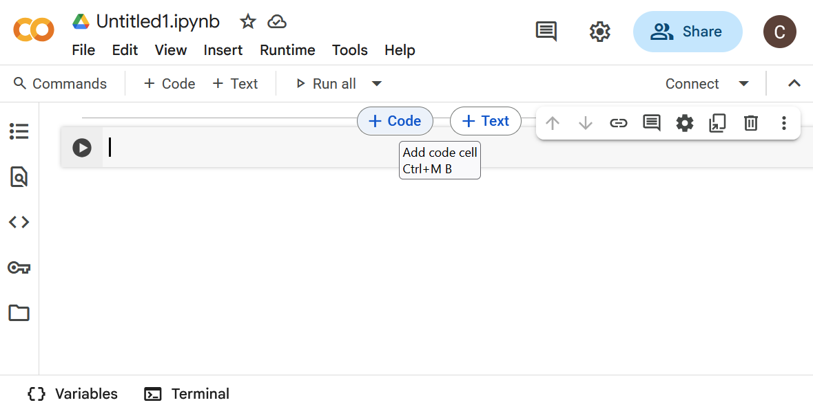
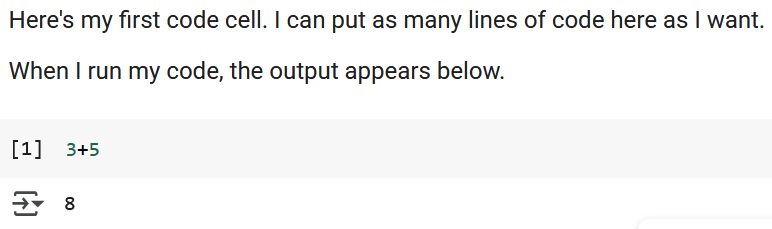

# Class 1B: Intro to colab and why program?

# 1. Introduction to Interactive Programming Using Google Colab

In this course, we will write and execute Python code using Google Colab—short for "Collaboratory"—rather than spending class time configuring development environments. Colab provides a browser-based coding platform that is especially well-suited to interactive programming and data-driven tasks. It supports Python natively and includes built-in libraries commonly used in engineering and data science.

### Why Google Colab?

Colab offers numerous advantages that make it ideal for classroom use:

- No installation required — code runs directly in the browser
- Interactive execution — edit code cells and rerun immediately
- Markdown integration — include documentation and notes alongside code
- Pre-installed libraries — access tools like NumPy, Pandas, and Matplotlib
- Seamless cloud storage — notebooks save automatically to Google Drive

This cloud-based structure allows students to focus on learning programming concepts without worrying about local machine setup or compatibility issues.

## Understanding Notebook Structure

Google Colab notebooks are organized as a sequence of cells, which can contain either formatted text or executable code. This structure encourages an interactive, readable approach to programming—making it easy to mix explanation and execution in a single document.

A new Colab notebook will look like this:



It automatically includes a single code cell.  If you mouse over the hidden “bars” between cells like we’ve done here, you’ll see the buttons to add cells.

### Markdown Cells vs. Code Cells

There are two types of cells used in Colab:

- **Markdown cells** allow you to format explanations, instructions, or comments using rich text. These cells do not execute code, but they help make the notebook readable and instructional.
- **Code cells** contain Python code and can be run independently. Each time a code cell is executed, Colab returns the result directly below it.

### Execution Prompts

Python code written in basic interpreters like the command-line Python shell is often preceded by prompts such as `>>>` for input and `...` for multiline input. In contrast, Colab adopts a numbered format:



Each time a cell runs, its input/output numbers update to reflect the order of execution.

### Example: Multiline Expressions

Python allows multiline expressions using parentheses, which is particularly useful when lines are long or logically grouped:

Python Shell:

```python
>>> (1 + 2 +

... 3 + 4)

10
```

In Colab:


## Running Code in a Colab Notebook

Executing Python code in a Colab notebook is simple and intuitive. Each code cell acts like a self-contained mini-program that can be edited and rerun without affecting the rest of the notebook.

### How to Run a Code Cell

To execute a code cell:

- Click inside the cell and type your Python code
- Press `Shift + Enter` to run the cell and move to the next one
- Or, click the **Run** button (a small ▶️ at the left of the cell, see the bottom cell in the image above)

Colab displays the result of each cell directly below the code, allowing you to verify your output immediately.

This responsive execution model allows for quick experimentation and encourages exploratory learning.

## Writing Python Code: Structure and Comments

Python code is designed to be clean and readable, following a straightforward syntax that makes it ideal for beginners and professionals alike. At its core, Python code consists of **variables, expressions, functions**, and **control flow** statements.

### Using Comments to Document Your Code

In Python, anything following a # symbol is considered a **comment** and is ignored by the interpreter. Comments are crucial for documenting what your code does and why—it’s a habit of good programmers.
```python
# This is a comment explaining the next line
temperature = 72
```
Use comments to explain complex logic, specify units, or provide context to collaborators (and to your future self).  Comments appear green in Colab so you can distinguish them from executable code.

## Declaring Variables in Python

A **variable** is a named reference to data stored in memory. Variables allow you to label information and refer back to it later in your program.

Python uses **assignment statements** to create variables:

```python
variable_name = value
```
There’s no need to declare a type in advance—Python automatically infers it based on the assigned value. (That squiggly line is Colab telling you there’s something off with your formatting.  Here, it’s expecting single quotes around the word value, because value is a string.  More on that later.)

### Example: Storing and Displaying Data

```python
name = 'Alice'      #Asssigning a string
age = 21            #Assigning a number
print("Student name:", name)
print("Student age:", age)
```
```
Student name: Alice
Student age: 21
```

This approach makes Python flexible and efficient for quick experimentation and rapid development.

## Modifying Variables Dynamically

One of the powerful features of Python in Colab notebooks is the ability to **change the value of variables** and immediately rerun code cells to observe the updated behavior. This dynamic workflow enables rapid experimentation and real-time debugging.

### Reassigning Variable Values

You can reassign a new value to an existing variable at any time:

```python
x = 5
print("Initial value:", x)
```
```
Initial value: 5
```

Later in the notebook, you might update that value:

```python
x = x + 10      #Increments the value of x
print("Updated value:", x)
```
```
Updated value: 15
```
This approach reinforces the **interactive nature of Colab notebooks**. You’re not tied to a fixed sequence of execution—each cell can be run and rerun independently, which makes it easy to refine your logic, explore hypotheses, and test different outcomes on the fly.

## Saving and Accessing Notebooks via Google Drive

Colab notebooks live in the cloud, which means your work is automatically saved and easily accessible from any device with internet access. Throughout this course, all assignments and coding activities will be distributed as notebook links via our course site.


### Saving Your Own Copy

To preserve your edits and submit work:

1. Open the shared Colab link from Blackboard.
2. In the notebook menu, click **File → Save a Copy in Drive**.
3. Your personal copy will be saved to a folder called “Colab Notebooks” in your Google Drive.

This copy is fully yours—you can modify, rename, or organize it however you’d like.

### Accessing Work Later

Once saved, you can return to your notebook at any time by navigating to:

**Google Drive → Colab Notebooks → [Your File Name].ipynb**

If you’re going to turn the file in, we recommend adding your name to the end of the original file name, which will correspond to the class it was assigned in.  There’s no need to redownload or re-upload anything; your work stays synced across sessions.

💡 Tip: You can also bookmark your personalized notebook links for even faster access.

Perfect—here we go with the next section, carrying forward that same voice and clarity:

# 2. Why Engineers Need Programming

Programming is a fundamental skill for modern engineers. Whether you're designing mechanical systems, analyzing electrical circuits, or processing large datasets, code provides a powerful toolkit for solving problems efficiently and accurately.

### How Programming Enhances Engineering Practice

Here are just a few ways that programming empowers engineers:

- **Automating repetitive tasks** — like data processing, simulation, or report generation
- **Modeling and simulating systems** — such as stress analysis or heat transfer
- **Controlling hardware and interfaces** — for robotics, sensors, or embedded systems
- **Analyzing and visualizing data** — making sense of complex experiments or diagnostics

Mastering programming doesn’t just make tasks easier—it expands what’s possible.

## Data in Programming: The Role of Variables

To harness the power of code, you’ll first need to understand how computers store and manipulate information. That starts with **variables**.

A variable is like a labeled container for data: it holds a value that can be retrieved or changed over time. This makes variables fundamental to virtually every program you’ll write.

Think of a **digital thermometer** that updates the room temperature in real time. Each time the sensor reads a new value, it updates the variable storing that temperature.

## Declaring and Updating Variables in Python

In Python, **variables** are created using a simple assignment statement, binding a name to a value. There’s no need to specify a data type in advance—Python uses dynamic typing to determine the type automatically based on the assigned value.

### Assignment Syntax

```python
variable_name = expression
```
This straightforward syntax allows for quick experimentation. Python evaluates the right-hand side and assigns the result to the variable on the left.

### Examples

```python
x = 10              #Integer
name = "Alice"      #String
temperature = 36.5  #Floating-point (float )
```

Variables in Python can be re-assigned easily—reusing the name to reference a new value.
```python
x = x - 2
print(x)
```
```
8
```
🔍 Note: Python doesn’t mutate the value in place—it reassigns the variable name to a **new memory location** containing the updated value. This detail becomes important when working with mutable and immutable data types.

## Writing Readable Code: Naming Conventions

Good variable names make code easier to understand, debug, and maintain. In this course, we’ll follow the standard naming style for Python: **snake_case**.

### What is snake_case?

Snake_case means writing compound names in all lowercase, separating words with underscores:

```python
student_name = "Alice"
total_cost = 49.99
```

This contrasts with other styles like:

- ```camelCase``` → e.g., ```studentName```
- ```PascalCase``` → e.g., ```StudentName```

Python programmers overwhelmingly prefer snake_case for variables and function names.

### Best Practices for Naming

- ✅ Use names that clearly describe the variable’s role (```volume```, ```speed_limit```, ```sensor_value```)
- ✅ Stick with lowercase letters and underscores
- ❌ Avoid using Python **keywords** (e.g., ```print```, ```def```, ```if```)
- ❌ Never start a name with a number (e.g., ```3data``` is invalid)

### Examples

```python
#Good
price_per_item = 5.99
user_input = "hello"

#Bad
p = 5.99        #too vaue
xyz = "hello"   #Meaningless
```

## Data Types in Python

Every piece of data in a Python program has a **type**—a classification that determines what kind of information it is and what operations can be performed on it. Python includes several built-in data types that are commonly used in engineering and scientific programming.

### Numeric Types

Python supports three primary numeric types:

- ```int```: Integer values (whole numbers)
- ```float```: Numbers with decimal points
- ```complex```: Numbers with real and imaginary parts

```python
population = 5000       #int
pi_value = 3.14159      #float
voltage = complex(3,4)  #complex (3 + 4j)
```

Python also supports **scientific notation** for very large or small numbers:

```python
distance = 2e3      #equivalent to 2000.0 (float)
distance
```
```
2000.0
```
## Arithmetic Operators

You can use a variety of math operators with numeric types—just like you would in a calculator.

| Operator | Description              | Example  | Result |
|----------|--------------------------|----------|--------|
| `+`      | Addition                 | `3 + 2`  | `5`    |
| `-`      | Subtraction              | `7 - 4`  | `3`    |
| `*`      | Multiplication           | `6 * 2`  | `12`   |
| `/`      | Float Division           | `5 / 2`  | `2.5`  |
| `//`     | Integer (floor) Division | `7 // 2` | `3`    |
| `%`      | Remainder (modulus)      | `7 % 4`  | `3`    |
| `**`     | Exponentiation           | `5 ** 2` | `25`   |

These operators can be used with variables as well:

```python
width = 5
height = 2
area = width * height
print("Area:", area)
```
```
Area: 10
```

Python evaluates expressions following standard order of operations (PEMDAS), so parentheses can help group operations as needed.

##Other Common Python Data Types

Beyond numbers, Python provides built-in types for handling text, logical values, and structured collections. These are essential for representing real-world information in programs.

`str`: **Strings (Text)**

A **string** is a sequence of characters enclosed in quotes.

```python
message = 'Welcome to programming!'
print(message)
```
```
Welcome to programming!
```

You can store names, messages, filenames—any kind of text. Strings can also include escape characters like `\n` for new lines. 

### Boolean Values

A **boolean** (or `bool`) represents truth values—either True or False. Booleans are commonly used in comparisons and control flow.

```python
is_ready = True
has_errors = False
print(is_ready, has_errors)
```
```
True False
```

### Ordered Collections

A **list** holds multiple items in a specific order. Lists are **mutable**, meaning you can change their contents.

```python
temperatures = [70, 68, 75, 73]
# You access elements by index (starting at 0):
print(temperatures[2])
```
```
75
```

### Immutable Sequences

A **tuple** is similar to a list but **cannot be changed** after it's created.

```python
dimensions = (1920,1080)
dimensions
```
```
(1920,1080)
```

Tuples are useful when you want to group related values that should remain fixed.  Note the difference between declaring a list and a tuple.  The list uses square brackets while the list uses parentheses.

### Key-Value Pairs

A **dictionary** maps keys to values—like a miniature database.

```python
student = {"name": "Alice", "age": 21}
# You can look up values by key:
print(student["name"])
```
```
Alice
```

### Unique Unordered Values

A **set** is an unordered collection of unique items—duplicates are automatically removed.

```python
colors = {"red","blue","green","blue"}
print(colors)
```
```
{'green', 'red', 'blue'}
```
These types will be explored more deeply in future lessons, but it's helpful to start seeing how varied and flexible Python’s data structures are.

## Constants and Immutability

Some values in a program are intended to remain unchanged throughout its execution. While Python doesn't enforce constants the way some languages do, there are standard conventions for signaling that a variable should not be altered.

### Representing Constants in Python

Although Python lacks a built-in `const` keyword, programmers use all-uppercase variable names to indicate constants:

```python
PI = 3.14159
MAX_SPEED = 120
```

Using uppercase helps convey intent: these values should not be reassigned during program execution. It’s a convention—Python won’t prevent changes, but the community encourages treating such values as fixed.

## Immutable vs. Mutable Data

Certain data types in Python are **immutable**—once an object is created, it cannot be changed. Others are **mutable**, meaning their contents can be modified in place.

### Immutable Types Include:

- `int` – whole numbers (e.g., `5`)
- `float` – decimal numbers (e.g., `3.14`)
- `str` – text (e.g., `"hello"`)
- `tuple` – ordered groups (e.g., `(1, 2, 3)`)
- `frozenset` – unchangeable version of a set

### Mutable Types Include:

- `list` – ordered collections
- `dict` – key-value mappings
- `set` – unordered, unique values

### Important Clarification: Variables vs. Values

Even though immutable types like integers and strings can’t be altered **in place**, variables that refer to them **can still be reassigned**.

```python
x = x + 5
x = x + 1 # Now x refers to a new object with the value 6
x
```
```
6
```
In this example, x didn’t mutate the number `5`; rather, Python created a **new** integer object (`6`) and reassigned the name `x` to it.

The same is true for strings:

```python
name = "Alice"
name = name + "Smith" # Creates a new string; original "Alice" is unchanged
name
```
```
'Alice Smith'
```
This behavior will become more important as we move into collections, where mutability affects how variables interact with memory and references.

## Python’s Built-in Functions

Python provides a wide collection of **built-in functions**—ready-made tools that perform common tasks. These functions are always available and don't require any imports. You’ve already met `print()` in earlier examples; now let's explore a few others that you'll likely use early and often.

### `print()`: Displaying Output 

Used to send output to the screen. You can print strings, variables, or expressions.

```python
x = 5
print("Value of x:", x)
print(x + 2)
```
```
Value of x: 5
7
```
Print is often used for debugging or giving feedback to users.

### `round()`: Rounding Numbers

Rounds a float to the nearest integer, or to a specified number of decimal places.

```python
round(7.6)
```
```
8
```

```python
round(8 / 3, 2)
```
```
2.67
```
This is helpful when formatting numeric results for display or reporting.

### `type()`: Checking a Variable’s Data Type

Returns the type of the value referenced by a variable.

```python
a = 3.14
print(type(a))
b = "hello"
print(type(b))
```
```
<class 'float'>
<class 'str'>
```
This is useful when debugging or when you’re unsure how Python is interpreting a value.

### `del`: Deleting Variables

Removes a variable from memory. Once deleted, a variable can’t be used until reassigned.


Use `del` with care—it’s not often needed in beginner programs.

### A Naming Note: Don’t Shadow Built-ins

Avoid using the same names as Python’s built-in functions for your own variables:

```python
print = "Oops   # This overwrites the print function!
```
If you accidentally overwrite one, you can recover it by restarting your Colab runtime or using `del print`.